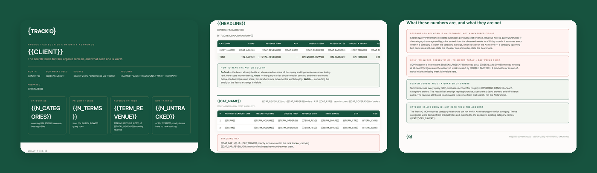

# TrackIQ: Amazon Category Priority Keywords

Answers one question per product category: **which search terms should we be
tracking organic rank on, and what is each one worth?**

Rank trackers drift toward brand terms while the revenue sits in generic head
terms nobody added. This finds those terms, prices them, and tells you which
ones your tracker is missing.

Built as an [Agent Skill](https://code.claude.com/docs/en/skills). Runs in
Claude Code, Claude web, Claude desktop and ChatGPT from the same folder.

---

## Powered by the TrackIQ MCP

[](https://trackiq.com/mcp)

This skill reads your live Amazon account through the
**[TrackIQ MCP](https://trackiq.com/mcp)** — 16 tools connecting your AI
assistant to Amazon data:

Sales & Traffic · Orders · Inventory · Returns · Sponsored Products · Sponsored
Brands · Sponsored Display · Amazon DSP · AMC Cloud · Keywords · Search Terms ·
Targeting · Search Query Performance · Organic Rank · Best Seller Rank · Buy Box
History · Brand Analytics · Export

Works with Claude, ChatGPT and Cursor. **[Get access →](https://trackiq.com/mcp)**

---

## What you get



*One report, three views: the cover and headline counts, a category's ranked
terms with the tracking gap, then the method and limits.*

One self-contained `.html` report.

| Section | What it does |
|---|---|
| **Cover** | Categories, priority terms, revenue on them, and how many are untracked |
| **Headline** | The account-level table: ASINs, revenue, ASP, queries seen and terms passed per category |
| **How to read the action column** | What Defend, Grow and Watch mean, in the report itself |
| **Per category** | The top 25 priority terms — weekly volume, orders, estimated monthly revenue, impression share, CTR, CVR |
| **Tracking gap** | How many priority terms have no rank tracking, and the revenue sitting behind them |
| **Method and limits** | What the numbers are, and explicitly what they are not |

Every term is labelled:

- **Defend** — converts and holds above-median impression share. Already won; losing rank costs money now.
- **Grow** — above-median demand, below-median share. The opportunity.
- **Watch** — small but real, on the list so a change is visible.

## Requirements

- The **TrackIQ MCP**, for `get_search_query_performance`,
  `get_product_performance`, `get_product_categories_performance`,
  `get_keyword_rank` and `list_marketplaces`
- **SQP ingestion running on the account.** It's a separate weekly feed and is
  often sparse or absent on newer brands. The skill checks before promising a
  report.
- Nothing else. No filesystem, no shell, no internet.

**Without the MCP** it works from a Brand Analytics Search Query Performance
export (ASIN view, one file per week) plus revenue and orders by ASIN.
Everything except the rank-tracker column is reproducible that way.

---

## Install

### Claude Code

```
/plugin marketplace add TrackIQ-HQ/amazon-seller-skills
/plugin install trackiq-amazon-category-priority-keywords@trackiq
```

### Claude web, desktop, mobile

1. Download the `.zip` from the
   [latest release](https://github.com/TrackIQ-HQ/trackiq-amazon-category-priority-keywords/releases)
2. **Settings → Capabilities → Skills** (code execution must be on)
3. **Create skill → Upload a skill**, choose the `.zip`
4. Toggle it on

### ChatGPT

Same zip. **Plugins → Skills → Create → Upload from your computer.**

---

## Setup

Answers live in `account.md`, copied from
[`assets/account.example.md`](skills/trackiq-amazon-category-priority-keywords/assets/account.example.md).
**Every TrackIQ skill reads the same file**, so an account already set up for
the daily or weekly send needs nothing added.

## Delivery

Where the report goes is asked once and stored in `account.md`: **in-chat**
(default), **file**, **Slack**, **n8n** or **email**. Anything leaving the chat
confirms with you first, and falls back to in-chat — with a note — when the
configured channel isn't available.

## When to run it

On onboarding, when the catalogue changes, and quarterly after that. Not
weekly. The list should be stable between runs; if it isn't, something changed
in the catalogue or the category rules.

This decides **which** keywords to track. The daily and weekly reports tell you
how you're ranking on the ones already tracked.

---

## Customizing

| To change | Edit |
|---|---|
| Brand, categories, delivery | `account.md` — no skill edits |
| Categorisation rules, gates, labels, revenue maths | `assets/method.md` |
| The pull sequence and its traps | `assets/pulls.md` |
| The pre-send checks | `assets/checks.md` |
| The report shell | `assets/report-template.html` |

Four rules are load-bearing and worth leaving alone.

**Discover which SQP weeks exist before using any of them.** The feed is
intermittent and a missing week returns `{"rows": []}`, not an error. Assuming
four weeks when two arrived silently halves every revenue figure.

**Never allocate a category's whole revenue across its queries by purchase
share.** It ties out to a clean total and overstates every keyword by roughly
4×, because search accounts for only 10–35% of orders.

**Revenue per keyword is derived, not measured.** SQP reports purchases, never
revenue. The report states all three assumptions behind the estimate.

**Relevance is a judgement, and it gets recorded.** No metric separates a head
term from a high-volume coincidence — a query can carry 107,000 searches, nine
purchases, and be irrelevant. Dropped terms and the reason are written down so
the next run doesn't re-litigate them.

---

## Contributing

```bash
python scripts/validate.py    # must exit 0 before any commit
python scripts/build.py       # writes dist/ zip + registry.json
```

Read [AUTHORING.md](https://github.com/TrackIQ-HQ/amazon-seller-skills/blob/main/AUTHORING.md)
before proposing changes.

## License

MIT. See [LICENSE](LICENSE).
